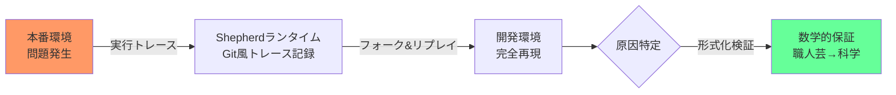
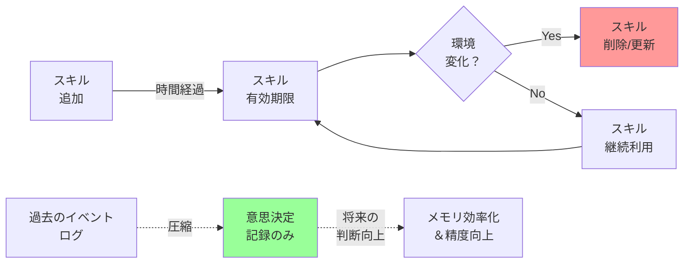

# Shepherd——エージェント実行のGit管理、形式化の時代へ

**2026-05-13 | 読了 5分 | #AIエージェント #形式化 #デバッグ**

> Lean言語で形式化されたエージェント操作モデルとGit風の実行トレースにより、「なぜそのアクションを取ったか」を完全に再現・デバッグできるランタイム基盤が登場した。

---

## Shepherd：エージェントデバッグの「Git」

AIエージェント開発における根本的な課題——「なぜエージェントがその行動を取ったのか分からない」問題に対し、根本的な解決策を提示した論文が公開された [1]。

**Shepherd**は、エージェントの操作を定理証明支援系Leanで形式的に定義し、すべての相互作用を型付きイベントとして記録するランタイム基盤だ。注目点は「Git風トレース」という概念——エージェントの実行履歴がGitのコミット履歴のように管理され、任意の過去状態からフォーク（分岐）してリプレイ（再実行）できる。

本番環境で発生した問題を開発環境で完全再現し、「この入力でこのツール呼び出しが失敗した」という粒度での原因特定が可能になる。形式化によりエージェントの振る舞いへの数学的保証も視野に入り、エージェント開発が「職人芸」から「エンジニアリング」へと進化する転換点になりうる。

---

## 論文ピックアップ

### 動的スキルライフサイクル管理 [2]

LLMエージェントが学習したスキルを「永続的に蓄積する」従来アプローチの限界を指摘し、スキルの追加・更新・削除を動的に管理する手法を提案する。現実世界では環境が変化し、古いスキルが有害になることも。RAGベースのスキル管理を実装する際は「スキルの寿命管理」視点が重要だ。

### 記述ではなく決定を記憶せよ [3]

「過去を正確に覚える」のではなく「将来の意思決定に役立つ情報を残す」という評価軸でメモリ圧縮戦略を導出した情報理論的アプローチ。長時間タスクを扱うエージェントのメモリ爆発問題に理論的基盤を与える重要な貢献だ。

### AI Workflow Storeによる堅牢性設計 [4]

「LLMに任せれば計画から実行まで一気通貫」という主流パラダイムに警鐘を鳴らす。ソフトウェア工学で培われた反復設計・テストプロセスをエージェントに組み込む「Workflow Store」を提案する。エージェントの品質保証に悩む開発者に示唆に富む。

---

## ツール・ニュース

**OpenAI Codex安全運用指針** [5]——サンドボックス化、人間承認フロー、ネットワークポリシー、エージェント専用テレメトリの4層防御が詳述される。自社でコーディングエージェントを導入する際の必読資料だ。

**E2a：AIエージェント向けメールゲートウェイ** [6]——エージェントがメールを送受信するオープンソースゲートウェイ。企業環境でのエージェント統合に実用的なOSSとして注目。

**コミュニティの声**——「エージェント間を自然言語で繋ぐ設計はアンチパターン。クリップボードでデータ連携するようなもの」という指摘が話題に。マルチエージェント設計では構造化プロトコルを使うべきだという議論が活発化している。

---

## おわりに

Shepherdのような形式化フレームワークが登場したことは、エージェント開発が真の意味で「デバッグ可能」な領域に入る可能性を示唆しているように感じる。これまで私たちは「なぜそうしたのか分からない」という霧の中で開発してきたが、形式化によってその問いに初めて科学的に向き合えるようになるのではないだろうか。職人芸から科学へのシフトが、本当に実現する日も近いと信じたい。

---

## 参考文献

- [1] Shepherd: A Runtime for Formalizing Meta-Agent Operations (arXiv)
- [2] Dynamic Skill Lifecycle Management for LLM Agents (arXiv)
- [3] Memory as Decision Records: Information-Theoretic Agent Memory (arXiv)
- [4] AI Workflow Store for Robust Agent Design (arXiv)
- [5] [OpenAI: Building a safe, effective sandbox to enable Codex on Windows](https://openai.com/index/building-codex-windows-sandbox)
- [6] [E2a: Email Gateway for AI Agents (GitHub)](https://github.com/e2a-ai/e2a)

---

*収集ソース: arXiv, OpenAI Blog, Hacker News, GitHub*
*2026-05-13*
